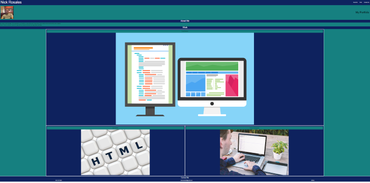

# <My Portfolio>

## Description

In this challenge I built a portfolio website. This will be used so employers can see my portfolio and view my differnt projects I've made.  I learned how to build i website from the ground up and all the challenges that go along with it. 

## Screenshot

## Credit

Worked with a partner Marcus Paccapaniccia 
This is his github https://github.com/mpacct/My-Portfolio

## Link to Deployed Webpage and Repository

https://github.com/nickrosales/Portfolio
https://nickrosales.github.io/Portfolio/